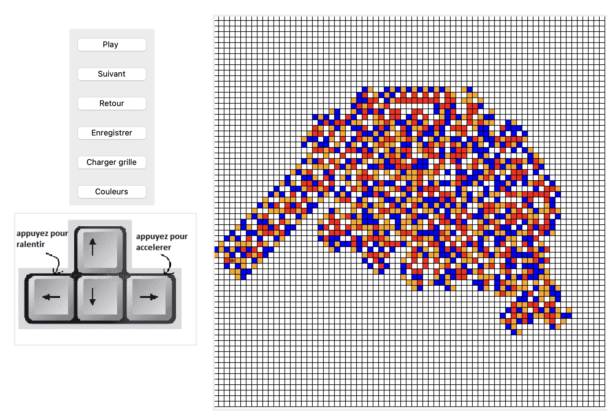

# Projet : Fourmi-de-Langton

--------------------------------------------------------
## Groupe MI TD2 (groupe de projet n°3)
Ania AOUAOUCHE  
Tiphanie DEPREAUX  
Baptiste PARIS  
   
https://github.com/uvsq22102500/Fourmi-de-Langton
  
-------------------------------------------------------- 

Voici une réprésentation de notre Fourmi de Langton :

**Présentation des différentes Fonctionnalités**

Une fourmi que nous avons choisi de représenter par une flèche est initialisée sur une grille blanche.  
Pour jouer avec la fourmi, on dispose de 7 boutons (dont deux boutons réversibles : play/pause, couleurs/pause couleurs) :

* Play : Lance la fourmi  qui se déplacera d'une case toutes les 100ms (cf le principe de l'automate ci-dessous)
* Pause : Ce bouton n'apparaît que lorsque play est active, il stop la fourmi
* Suivant : Déplace la fourmi case par case
* Retour : Fait revenir la fourmi d'une étape en arrière
* Couleur : Active la version couleur (cf l'explication de l'automate ci-dessous)
* Pause Couleurs : Ce bouton n'apparaît que lorsque Couleurs est active, il stop la fourmi
* Enregistrer : Enregistre une instance dans un fichier
* Charger Grille : Par défaut, on obtient un enregistrement déjà effectué d'un fourmi de Langton. Cet enregistrement permet de voir rapidement le résultat de parcours d'une fourmi déjà bien avancée. Cependant, si on a effectué un enregistrement via le bouton "enregistre" au préalable, notre  grille enregistrée apparaît sur le canvas.

*NB : Il est possible de passer du noir et blanc à la couleur, pour cela ne pas oublier de stopper la fourmi à l'aide de "Pause" (resp. "Pause Couleurs") avant de passer de l'un à l'autre. Si la fourmi est en mouvement, une autre option est de simplement double cliquer sur "Play" pour obtenir la version noir et blanc ou sur "Couleurs" pour la version Couleurs*  

Une autre fonctionnalité est disponible pour la version noir et blanc de la fourmi. Elle consiste à changer la vitesse de déplacement de cette dernière.
Pour ce faire, il suffit de cliquer sur la flèche droite (est) du clavier (comme indiqué sur l'image ci-dessus) pour accélérer, on obtient alors un déplacement toutes les 25ms. Inversement, pour un ralentir avec un déplacement toutes les 500ms, cliquer sur la flèche gauche (ouest) du clavier. Pour revenir à la vitesse initiale (100ms), faire "Pause" et "Play" à nouveau.

-------
**Les Règles suivies par la fourmi :**

Règles de Base :

Si la fourmi se trouve sur une case blanche, elle pivote de 90° vers la droite, change la couleur de la case en noir et avance d'une case.  
Si la fourmi se trouve sur une case noir, elle pivote de 90° vers la gauche, change la couleur de la case en blanc et avance d'une case.  

Règles Fourmi Colorée :

Si la fourmi se trouve sur du blanc ou du rouge, elle pivote de 90 a droite, change la couleur de la case en orange et avance d'une case. La fois suivante, si la fourmi se retrouve sur du blanc ou du rouge, elle changera la couleur de la case en bleu (et non en orange) et tourne encore une fois a 90 droite. On tourne ainsi en bloucle, orange puis bleu puis orange, etc...  
Si la fourmi se trouve sur du orange ou du bleu, elle pivote de 90 a gauche, change la couleur de la case en rouge et avance d'une case. De la même manière que précédemment, la fois suivante la fourmi changera la couleur de la case en blanc (et non en rouge).

**Vous connaissez désormais toutes les subtilités de notre chère Fourmi de Langton. Have Fun !!!**

